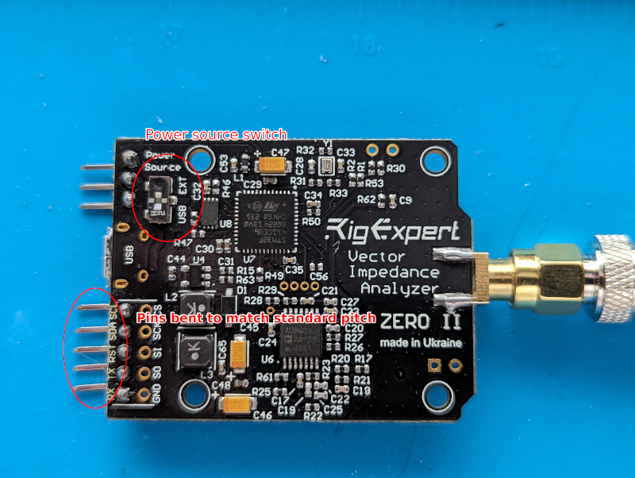

# zeroii-analyzer
Antenna analyzer based on RigExpert Zero II and Arduino

# Gotchas with the Zero II

When I first got my Zero II I could not get it to respond to UART, I2C or be
recognized as a USB device. It seemed like the device was dead. I found this
[video by Ed March, aka Professor Vector](https://www.youtube.com/watch?v=3K6qOPxwzps)
that answered some of my questions. The same guy has
[updated libraries for accessing the board](https://wb9raa.com/aazero2/).

Basically, there's a power switch on the board that determines if the board
gets power from the power pins or from USB. I switched it to "ext" and suddenly
I could power the thing.

I ended up using I2C and not flashing the firmware (contrary to the
[RigExpert guide](https://rigexpert.com/news/zero-ii-the-tiny-and-powerful-analyzer/))
# Dependencies

* `RigExpertZeroII_I2C` my version of it
* `MD_REncoder`
* `TFTLCD-Library` my version of it
